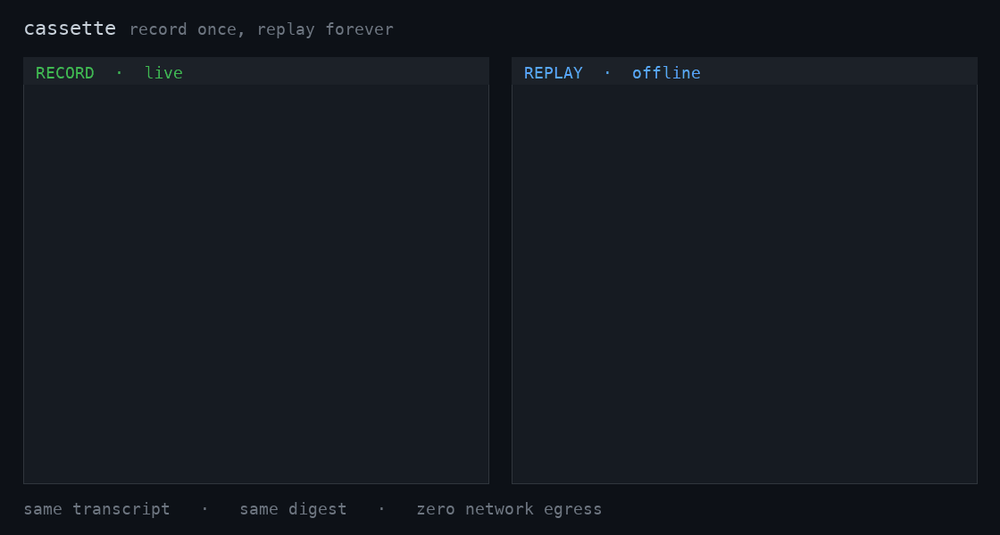
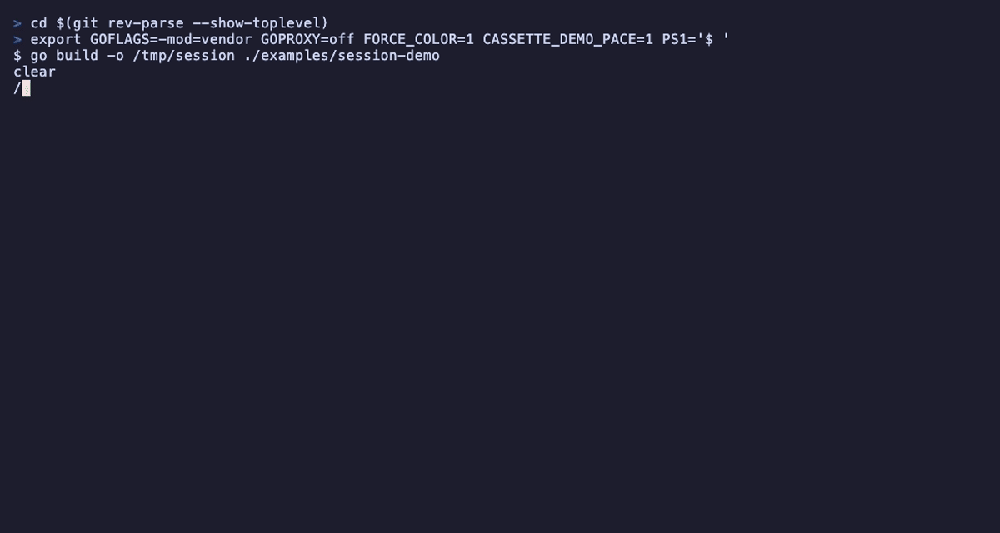

# cassette

[](https://github.com/faisalkhan91/cassette/actions/workflows/ci.yml)

**Record once → replay byte-exact, offline, forever** — a VCR for the agentic
stack: LLM **HTTP + SSE** *and* **MCP** tool calls, with secrets scrubbed on save.

Wrap an agent's HTTP client once (or point any language at `cassette proxy`);
**RECORD** real model + tool interactions to a readable, git-diffable fixture; then
**REPLAY** them deterministically with **no API key and no network**, so agent
tests run fast, free, and green in CI. Unlike a generic HTTP VCR
([vcrpy](https://github.com/kevin1024/vcrpy)/[nock](https://github.com/nock/nock)),
cassette captures **SSE streams verbatim** (frame boundaries included), reassembles
streamed tool calls, scrubs secrets by pattern, records **MCP** JSON-RPC, and can
**transpile a recorded corpus across providers** — see how it
[compares](docs/comparison.md).



## Why

Naive HTTP VCRs choke on the agentic stack. cassette handles the hard parts head-on:

- **SSE streaming** captured at the byte/transport layer and replayed verbatim —
  including original frame boundaries, `ping`/comment lines, and terminal events.
- **Streamed tool/function calls** reassembled from fragmented `input_json_delta`
  deltas, across adversarial chunk boundaries and multibyte UTF-8 splits.
- **Request nondeterminism** normalized away: reordered JSON keys, gzip vs
  identity, and volatile headers (api-key, request-id, idempotency-key, timestamps)
  never change the match.
- **MCP stdio (JSON-RPC)** — not HTTP — wrapped at the client-call boundary, so a
  real subprocess server is recorded once and never launched again on replay.

## Guarantee: byte-identical transport, not deterministic models

cassette guarantees **byte-identical transport replay** — the recorded bytes are
re-emitted exactly, so a recorded session reproduces the *same* agent output
every time. It does **not** claim that live models are deterministic. Equivalence
comes in two precise flavors:

- **WIRE equivalence** (byte-identical): replay output equals the cassette bytes
  exactly, SSE chunk boundaries included.
- **SEMANTIC equivalence** (equal after decoding): the assembled message — role,
  text, tool calls (arguments parsed-to-JSON-then-canonicalized), and stop reason
  — is identical once response-side volatile fields (`id`, timestamps, usage,
  per-chunk ids) are normalized out.

## How it works

Interception is a custom `http.RoundTripper` (never monkeypatching), injected
into the official SDK via `option.WithHTTPClient`:

- **Record** wraps the *base* transport (below SDK retries), tees the live SSE
  stream so the SDK still consumes it incrementally, and writes a scrubbed,
  deterministic YAML cassette atomically.
- **Replay** returns synthetic `*http.Response`s reconstructed from the cassette.
  The base transport is a **dial-blocking** transport: a cassette miss is a hard
  error, the network is never reached, and an atomic **dial counter** proves
  zero egress.

```
              your agent + official SDK
                       │  option.WithHTTPClient(c.HTTPClient())
                       ▼
          ┌──────────────────────────────┐
          │   cassette RoundTripper       │   one seam, both modes
          └───────────────┬──────────────┘
            RECORD         │         REPLAY
          ┌────────────────┴─────────────────┐
          ▼                                   ▼
   base transport                     dial-blocking transport
   (real network)                     (any dial = hard error)
          │ tee SSE to the SDK                │ derive match key → recorded response
          │ scrub secrets + canonicalize      │ atomic dial counter == 0  ✓ zero egress
          ▼                                   ▼
          └───────────────┬───────────────────┘
                          ▼
              ┌──────────────────────────┐
              │      cassette.yaml        │  readable · git-diffable · scrubbed
              │   (HTTP/SSE  +  MCP)      │  RECORD writes ─►   ◄─ REPLAY reads
              └──────────────────────────┘
```

## Install

```sh
# Homebrew (macOS/Linux)
brew install faisalkhan91/tap/cassette

# Docker
docker run --rm -v "$PWD:/w" -w /w ghcr.io/faisalkhan91/cassette:latest inspect session.yaml

# Go toolchain
go install github.com/faisalkhan91/cassette/cmd/cassette@latest
```

Or grab a prebuilt binary from [Releases](https://github.com/faisalkhan91/cassette/releases).
`cassette version` prints the build. The library is `import "github.com/faisalkhan91/cassette"`.

## Point it at your provider — `cassette up`

The fastest path, in any language: install once, then point your SDK's base URL at
the address `cassette up` prints. It records on the first run (auto-detecting the
provider) and replays byte-exact and **offline** on every run after — no key, no
network.

```sh
cassette up                                   # auto port + upstream; records, then replays
# → point your SDK here, e.g.
#     export ANTHROPIC_BASE_URL=http://127.0.0.1:PORT
#     export OPENAI_BASE_URL=http://127.0.0.1:PORT/v1
cassette open ./testdata/cassettes            # see what you captured (offline dashboard + transcript)
```

`up` decides record-vs-replay by whether the directory already holds cassettes, and
diagnoses a replay miss instead of a bare 404. For the OpenAI-compatible
`/chat/completions` path or a custom host, pass `--upstream <URL>`.

## Quickstart

Run the north-star demo — a realistic **multi-tool agent**: a barista assistant
makes **five sequential tool calls** (`list_menu` → `get_price` →
`check_inventory` → `caffeine_mg` → `brew_minutes`), then gives a final
recommendation — replayed from **real captured Claude streams**. The same agent
runs once **live** (recording against an in-process fake provider) and once in
**replay** with network egress made impossible, producing a semantically
identical six-turn transcript with provably zero outbound dials:

```sh
go run ./examples/agent-demo
```

Or a 5-prompt conversational session — recorded live, then replayed offline with
zero dials (`examples/session-demo`):



```sh
go run ./examples/session-demo     # or: scripts/demo.sh  (runs every demo, offline)
```

## Use it in your tests

```go
import "github.com/faisalkhan91/cassette/cassettetest"

func TestMyAgent(t *testing.T) {
    // Loads testdata/cassettes/TestMyAgent.yaml. Plain `go test` replays
    // (network blocked); `go test -update` records from the real provider.
    c := cassettetest.New(t, "")

    client := anthropic.NewClient(
        option.WithHTTPClient(c.HTTPClient()),
        option.WithBaseURL(baseURL),   // your provider in record; ignored in replay
        option.WithAPIKey("test"),
        option.WithMaxRetries(0),
    )

    // ... run your agent against `client` ...

    // The verify registered via t.Cleanup asserts every recorded interaction was
    // consumed and that zero network dials occurred.
}
```

MCP tools are wrapped at the client-call boundary:

```go
session, _ := mcpClient.Connect(ctx, &mcp.CommandTransport{Command: exec.Command("my-mcp-server")}, nil)
caller := c.MCP(session)            // records in record mode; serves from cassette in replay
result, _ := caller.CallTool(ctx, &mcp.CallToolParams{Name: "add", Arguments: args})
```

### Modes

Default is **replay** (safe/offline). Precedence: explicit API option >
`CASSETTE_MODE=record|replay|auto` > the `-update` test flag.

## Learn more

Start at the **[documentation hub](docs/README.md)**, or jump to:

- **[Getting started & guide](docs/guide.md)** — the 2-minute tour, cassette format, semantic-equivalence API, custom matching, stream timing.
- **[Command reference](docs/cli.md)** — every `cassette` subcommand, grouped.
- **[Feature deep-dives](docs/features.md)** — the offline LLM endpoint, the self-contained demo binary, the forward-branch bug-report workflow, `migrate`, `dashboard`, governance (`policy`/`audit`), OpenTelemetry export, provenance, and `init`/proxy onboarding.
- **[vs. alternatives](docs/comparison.md)** — how cassette compares to go-vcr, VCR.py, nock, PollyJS, mitmproxy, and the eval platforms.
- **[Security & data handling](docs/security.md)** · **[MCP](docs/mcp.md)** · **[Recipes](docs/recipes/README.md)** · **[FAQ & troubleshooting](docs/faq.md)** · **[Glossary](docs/glossary.md)**
- **[Demo gallery](docs/demos.md)** — the GIFs above, and how they're generated.

## Scope

Decodes/encodes **Anthropic** Messages, **OpenAI** Chat Completions & Responses, **Google Gemini**
(`streamGenerateContent`, both SSE and JSON-array framings), and **Ollama** native NDJSON
(`/api/chat`) — plus **MCP** stdio. The match key is path-only, so the **OpenAI-compatible family**
(Azure OpenAI, vLLM, Together, Groq, OpenRouter, Mistral, DeepSeek, Ollama's OpenAI-compat endpoint)
is covered automatically. The matching, format, transport, scrubbing, and `semequal` layers are
provider-agnostic, so further providers are additive (see [DECISIONS.md](DECISIONS.md)).
The full gate runs offline via [`scripts/ci.sh`](scripts/ci.sh).

Not just Go: `cassette proxy` runs as a reverse proxy, so an app in **any language** records and
replays by pointing its provider base URL at cassette, and `cassette author` builds a replayable
cassette from a terse YAML screenplay — no key, no network. See [docs/cli.md](docs/cli.md).

## License

[MIT](LICENSE).
