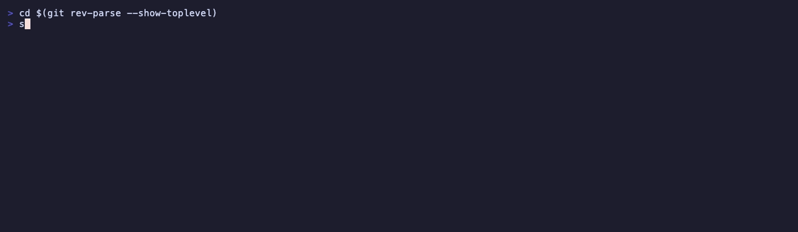
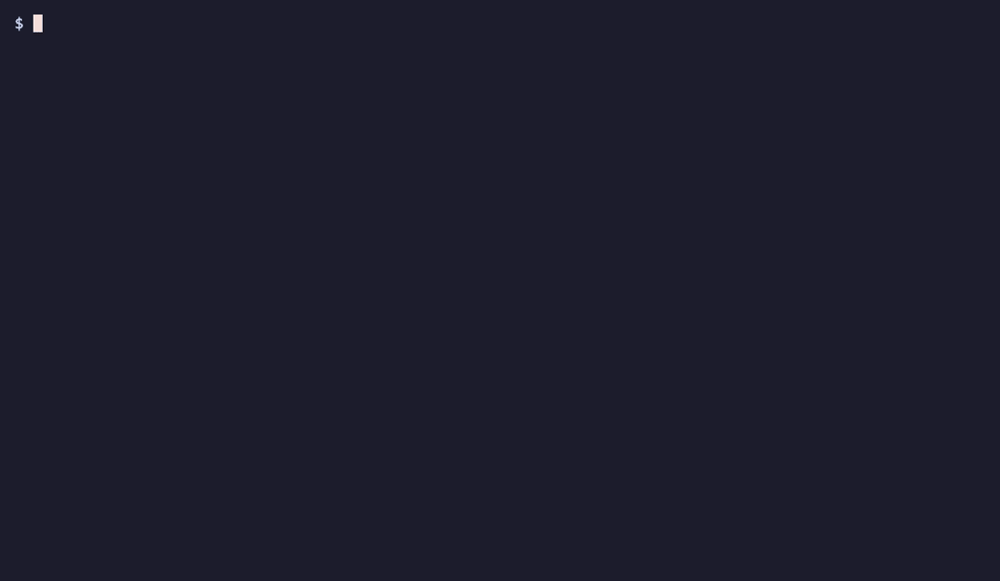
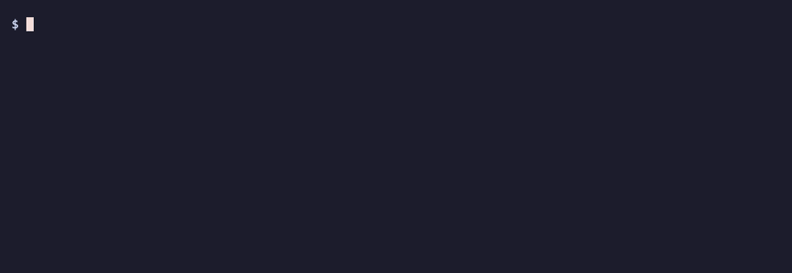
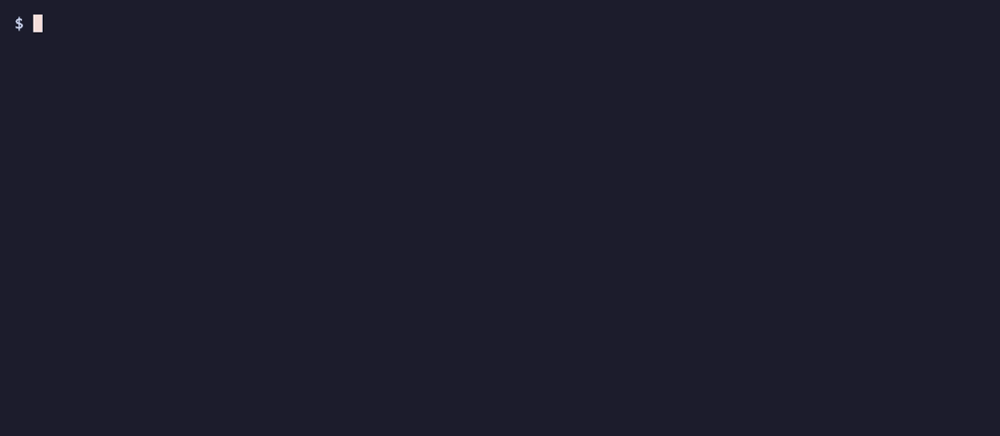
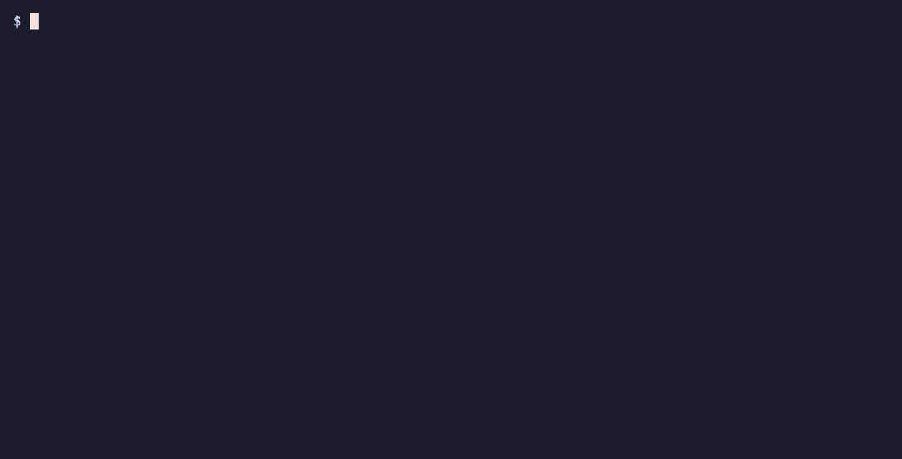
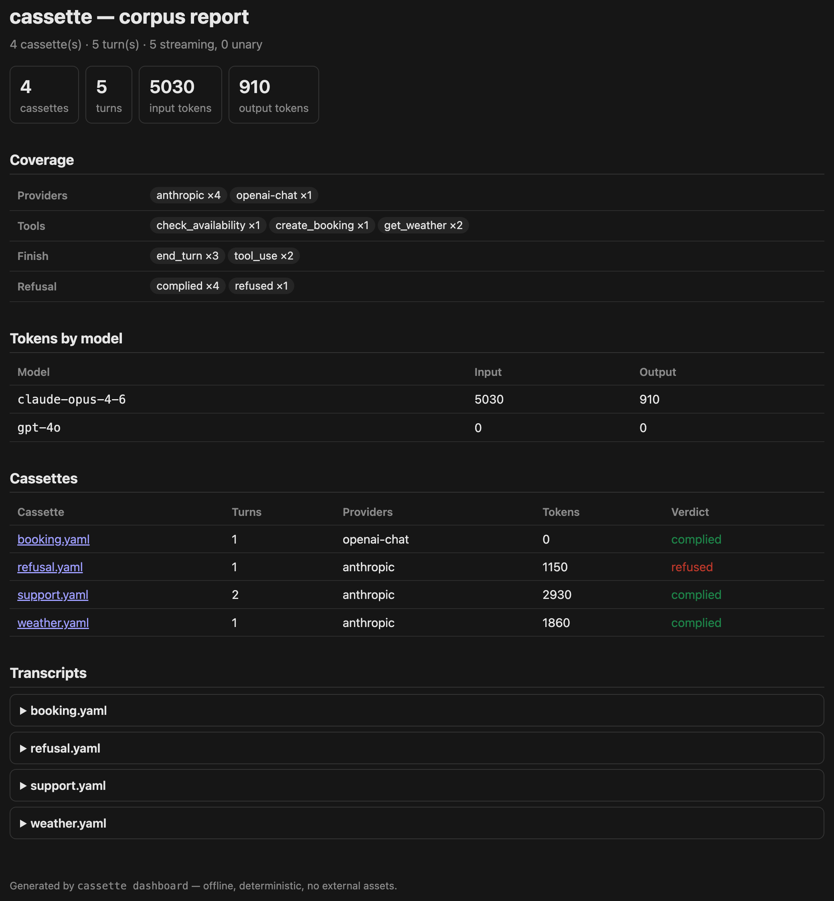

# cassette — demo gallery

Every asset here is generated offline and reproducibly from scripts in `scripts/`.
The Pillow renders use a system monospace font; the `vhs` renders are real terminal
recordings (their fixtures are authored by `scripts/feature-demo-setup.sh`); the
dashboard screenshot is headless-Chrome over an authored corpus — no API key, no
network.

## Record once, replay forever (hero)

The same coffee agent runs live (recording to a cassette) and offline (replaying
with the network blocked) — identical transcript and digest, provably zero
outbound dials.

_Regenerate:_ `python3 scripts/gen-demo.py`

## A 5-prompt live session

A five-prompt pair-programming conversation runs live (recording each turn), then
the same five prompts replay offline with the network blocked — identical replies,
zero dials. Source: `examples/session-demo`.

_Regenerate:_ `vhs scripts/session.tape`

## A 2-minute tour

A walk through the headline commands.

_Regenerate:_ `python3 scripts/gen-demo-tour.py`

## Serve as an offline endpoint (real split terminal)

Left serves a recording as a local LLM endpoint; right is a plain `curl` getting
the byte-for-byte replayed stream — no key, no network.

_Regenerate:_ `vhs scripts/demo.tape` (needs `vhs` + `tmux`; the underlying
`scripts/split-demo.sh` is recorder-agnostic, so `asciinema` works too).

## The Castiron forward-branch workflow (real split terminal)

Left shows a captured run that misbehaved; right grafts that one step to a fix,
diffs the change (red/green), and prepares a forward-branch seed to re-run live.

_Regenerate:_ `vhs scripts/branch.tape`

---

Color in the live demos is forced via `FORCE_COLOR=1` (the CLI honors
`FORCE_COLOR` / `CLICOLOR_FORCE`, with `NO_COLOR` taking precedence); on a real
terminal it auto-detects a TTY.

## Per-feature clips

Short, single-command clips of the headline features (all `vhs`-rendered from
authored fixtures; regenerate any with `vhs scripts/feat-<name>.tape`).

### Author a cassette from a spec — no key, no network

`cassette author` compiles a terse screenplay into a fully valid, replayable
cassette (verified to replay with zero dials before it's written); `cassette doc`
renders the transcript.

### Semantic diff — what actually changed

`cassette diff` surfaces only the behavioral change — text word-diff, tool-arg
change, finish flip — with volatile id/usage churn suppressed.

### Diagnose a replay miss

`cassette doctor` turns an opaque miss into the nearest record, the differing
request axis, and a named remedy.

### Prove the codec round-trips and the file replays

`cassette codec verify` proves the Transcript⇄wire codec is stable and
deterministic; `cassette conformance` proves the file actually replays, zero dials.

### Trace sensitive data across turns

`cassette taint` follows the flow: a value from the user, and one from untrusted
model/tool output, both carried outbound in a later request (masked).

### Migrate a corpus across providers

`cassette migrate` ports a whole corpus to another provider's wire dialect and
verifies every turn's semantic digest is preserved — fail-loud on drift, so a
provider switch is de-risked by your existing tests.

### Scaffold offline replay in any stack

`cassette init` lays down the offline-replay layout and prints the copy-paste proxy
base-url snippet for the detected stack — the 60-second cross-language onboarding.

### The offline dashboard (screenshot)

`cassette dashboard <dir> -o report.html` renders a corpus to a single
self-contained HTML file — coverage matrix, token totals, refusal verdicts, tool
usage, and per-cassette transcripts. No server, no external assets, deterministic.

_Regenerate:_ `bash scripts/gen-dashboard-shot.sh` (needs headless Chrome/Chromium + Pillow).
