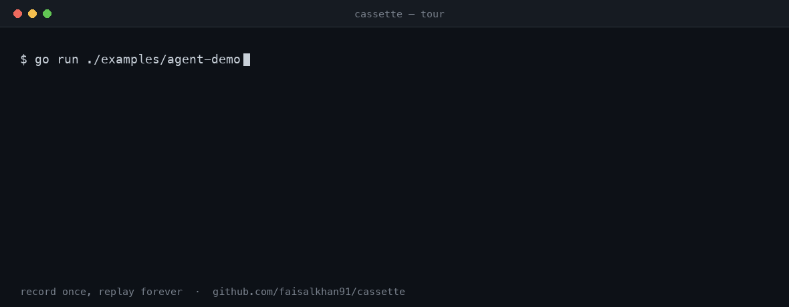

# cassette — guide

## Hello, world — a 2-minute tour



No keys, no network. This walks through setup, the core commands, and inspecting
a real recording — using a sample cassette that ships with the repo.

**Setup** (Go 1.27+):

```sh
git clone https://github.com/faisalkhan91/cassette && cd cassette
go install ./cmd/cassette        # puts `cassette` on your PATH (or use: go run ./cmd/cassette)
```

**1. Look at a recording.** The repo ships a real captured Claude stream at
`testdata/cassettes/anthropic_text_helper.yaml`:

```sh
cassette inspect testdata/cassettes/anthropic_text_helper.yaml   # structure, sizes, status
cassette doc     testdata/cassettes/anthropic_text_helper.yaml   # human-readable transcript
```

`doc` prints what the model actually said:

```
# Cassette: anthropic_text_helper.yaml
## 0. POST /v1/messages → 200
> Hello, world! 🌍
_finish: end_turn_
```

**2. Replay it as a live, offline endpoint.** Serve the cassette, then hit it with
anything — the recording answers, with zero network egress and no API key:

```sh
cassette serve testdata/cassettes/anthropic_text_helper.yaml --addr :8080
```

```sh
# in another shell — note the JSON Content-Type so the body matches the recording:
curl -s localhost:8080/v1/messages -H 'Content-Type: application/json' \
  -d '{"max_tokens":1024,"messages":[{"content":[{"text":"Hi there","type":"text"}],"role":"user"}],"model":"claude-opus-4-6","stream":true}'
# → streams back the recorded `event: message_start … Hello, world! 🌍 …` SSE
```

A request that doesn't match a recording returns `404 cassette_miss` — it never
falls through to the real provider.

**3. Ship it as one file.** Pack the recording into a self-contained binary that
serves a steppable browser transcript offline:

```sh
cassette pack testdata/cassettes/anthropic_text_helper.yaml -o demo
./demo                            # open the printed http://127.0.0.1:7070 in a browser
```

**4. Record your own.** In a test, wrap your provider client with the cassette's
HTTP client. `go test -update` records once from the real provider; plain `go test`
replays forever, offline:

```go
import "github.com/faisalkhan91/cassette/cassettetest"

func TestHello(t *testing.T) {
    c := cassettetest.New(t, "")                   // ↔ testdata/cassettes/TestHello.yaml
    client := anthropic.NewClient(
        option.WithHTTPClient(c.HTTPClient()),     // ← the one line that records/replays
        option.WithBaseURL(providerURL),           // used in record; ignored in replay
        option.WithAPIKey("test"),
    )
    // ... call client, assert on the result ...
    // The auto-registered cleanup verify checks every interaction replayed with zero dials.
}
```

```sh
go test -run TestHello -update                     # records testdata/cassettes/TestHello.yaml
cassette inspect testdata/cassettes/TestHello.yaml # check what got captured (secrets scrubbed)
go test -run TestHello                             # replays it, network blocked
```

That's the whole loop: **record once, replay forever.** The rest of this README
goes deeper.

## Cassette format

One human-readable, git-diffable YAML file per test under `testdata/cassettes/`,
with a `schema_version` and an ordered list of `interactions`. Bodies are stored
verbatim as text when UTF-8-safe (so SSE/JSON-RPC frames diff line-by-line) and
base64 otherwise — always byte-exact. Secrets are redacted and volatile response
fields stamped before writing. The full, language-independent format and match-key
algorithm are specified in [`spec/cassette-format.md`](spec/cassette-format.md).

## Semantic-equivalence API

The `semequal` package decodes a raw provider stream — Anthropic Messages, OpenAI
(Chat + Responses), Google Gemini, or Ollama NDJSON — into a normalized,
volatile-free `Transcript` and reduces it to a stable digest — the public form of
the SEMANTIC equivalence the demos assert:

```go
got, _ := semequal.DecodeOpenAISSE(rawSSE)     // or DecodeAnthropicSSE / DecodeOpenAIResponsesSSE / DecodeGeminiSSE / DecodeOllamaNDJSON
semequal.AssertSemanticEqual(t, got, want)     // fails with a transcript diff
```

## Custom matching

Normalize away request nondeterminism a path-drop can't express, via
`cassette.MatchConfig` hooks (applied identically at record and replay, for HTTP and MCP):

```go
opts.Match.BodyTransform = func(path string, body []byte, ct string) []byte { /* strip a field */ }
// or opts.Match.KeyFunc = func(in cassette.MatchInput) (string, error) { ... }  // HTTP, full override
```

These are public root-package types (`cassette.MatchConfig`, `cassette.MatchInput`,
`cassette.ScrubConfig`), so an external import can construct them directly;
`cassette.AzureMatchConfig()` and `cassette.DefaultScrubConfig()` are ready-made bases.

A partial `cassette.ScrubConfig` is **merged onto the defaults** field-by-field at
`Open` time: set only `BodyPatterns` and the default secret-header redaction and
response-stamp determinism (which keeps cassettes byte-stable) are preserved — a
field you set replaces only that field's default. Set `DisableScrub` to turn
redaction off entirely (not recommended; cassettes may then contain live secrets).

The match key is computed and persisted at **record** time, so a matcher config
must be set when recording. Changing it only at replay won't retroactively
re-match an existing cassette — re-record with the new config, or run
`cassette rekey` (see [DECISIONS.md](../DECISIONS.md)).

## Stream timing (opt-in)

`Options.CaptureTiming` records per-frame inter-arrival deltas; `Options.PaceStreaming`
re-emits them on replay (honoring context cancellation) — useful for timeout / TTFT /
cancellation tests. Default off (cassettes stay byte-stable). Deltas are *approximate*
arrival timing (SDK read boundaries), not exact server-flush reproduction.
